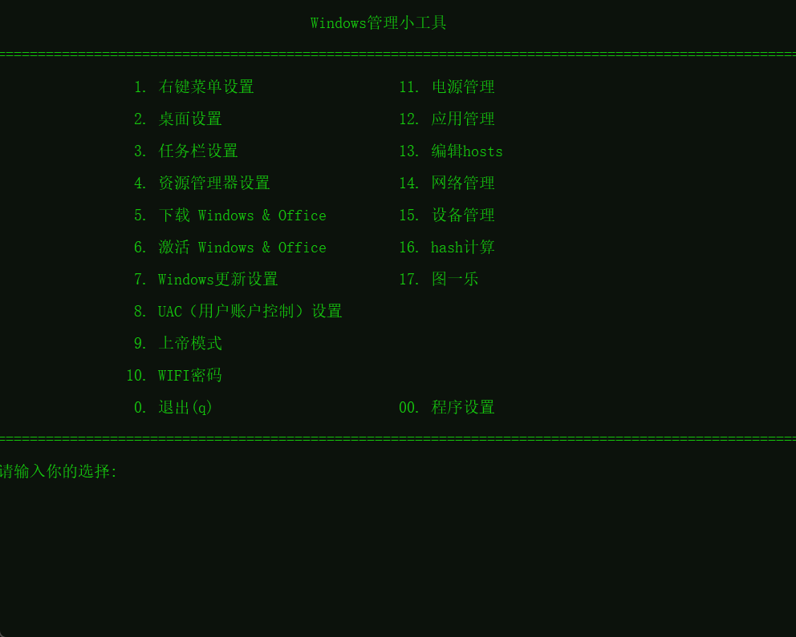

# Windows 管理小工具

这是一个功能丰富的批处理脚本，集成了多个 Windows 系统管理与优化工具，旨在简化日常维护和系统设置操作。支持中文界面，操作简洁直观。

## 💻 运行效果

## 🚀 功能列表

| 功能编号 | 描述                      |
| -------- | ------------------------- |
| 1        | 🖱️ 右键菜单设置            |
| 2        | 🖥️ 桌面设置                |
| 3        | 📌 任务栏设置              |
| 4        | 📂 资源管理器设置          |
| 5        | 🪟 下载 Windows & Office   |
| 6        | ✅ 激活 Windows & Office   |
| 7        | 🔄 Windows 更新设置        |
| 8        | 🛡️ UAC（用户账户控制）设置 |
| 9        | 🧙 上帝模式                |
| 10       | 📶 WIFI 密码               |
| 11       | 🔋 电源管理                |
| 12       | 🧹 应用管理                |
| 13       | ✏️ 编辑hosts               |
| 14       | 🖧  网络管理               |
| 15       | 🛠️  设备管理               |
| 16       | 😄 图一乐                  |
| 00       | ⚙️ 程序设置                    |
| 0 / q    | ❌ 退出程序                |

## ✏️详细功能

- 右键菜单设置
  - 切换 Windows 10 右键菜单
  - 恢复 Windows 11 右键菜单
  - 添加超级菜单
  - 删除超级菜单
  - 添加Hash右键菜单
  - 删除Hash右键菜单
- 桌面设置
  - 隐藏桌面图标小箭头
  - 显示桌面图标小箭头
  - 隐藏了解此图片（windows聚焦）
  - 显示了解此图片（windows聚焦）
  - 打开桌面图标设置
  - 添加网络连接
  - 添加IE快捷方式
  - 显示windows版本水印
  - 隐藏windows版本水印
  - 设置Bing每日桌面背景
  - 提取桌面壁纸
- 任务栏设置
  - 一键净化任务栏
  - 禁用小组件
  - 启用小组件
  - 卸载小组件
  - 安装小组件
  - 任务视图 — 隐藏
  - 任务视图 — 显示
  - 搜索 - 隐藏
  - 搜索 - 仅显示搜索图标
  - 清除固定（Edge、商店、资源管理器）
  - 自动隐藏任务栏 — 开启
  - 自动隐藏任务栏 — 关闭
  - 时间显示秒
  - 时间隐藏秒（默认）
- 资源管理器设置
  - 默认打开[此电脑/主文件夹]
  - 文件扩展(后缀)名开关
  - [单击/双击]打开文件
  - [显示/隐藏]复选框
  - [显示/隐藏]系统隐藏文件
  - U盘禁用开关
  - 导航栏-主文件夹开关
  - 导航栏-图库开关
  - 导航栏-控制面板开关
  - 导航栏-重复驱动器开关
  - 清理图标/缩略图缓存
- 下载 Windows & Office
  - Windows
    - 山己几子木
    - Microsoft官方
    - NEXT,ITELLYOU
    - 不忘初心
    - 吻妻
  - Office:
    - xb21cn
    - Office Tool Plus
    - Microsoft官方
- 激活 Windows & Office
  - Microsoft Activation Scripts (MAS)
  - HEU_KMS_Activator
- Windows更新设置
  - 暂停更新至2999年
  - 恢复更新
- UAC（用户账户控制）设置
  - 从不通知
  - 恢复默认
  - UAC开启/关闭
  - 打开UAC手动设置
- 上帝模式
- WIFI密码
- 电源管理
  - 设置定时关机/重启/休眠
  - 禁用自动睡眠*
  - 打开电源选项
  - 禁用休眠(删除 hiberfil.sys)
  - 启用休眠
- 应用管理
  - 一键卸载预装应用
  - 打开程序和功能
  - OneDrive安装/卸载
  - 微软拼音输入法设置
    - 双拼输入
      - 软微双拼
      - 智能ABC
      - 自然码
    - 全拼输入
    - 打开微软拼音设置
- 编辑hosts
- 网络管理
  - 网络信息
  - 打开网络连接控制面板
  - 清除DNS缓存
  - MAC地址
  - ping检查
  - tracert路由追踪
  - 我的外网IP
  - 检查端口占用
  - 测速网
  - telnet设置
    - 安装telnet客户端
    - telehack.com
  - 远程桌面
  - 一键断网/联网
  - 防火墙设置
    - 关闭
    - 开启
    - 重置
    - 手动
  - 系统代理设置
    - 设置代理
    - 关闭代理
    - 当前状态
    - 打开系统代理设置界面
  - 端口转发
    - 添加端口转发规则
    - 删除端口转发规则
    - 查看当前规则
    - 清空所有规则
- 设备管理
  - 照相机开关
  - 蓝牙开关
- 图一乐
- 程序设置
  - 更换主题
  - 检查更新
  - 关于

## 📦 使用说明

1. **双击 `WindowsManageTool.bat` 运行**  
   因为工具的很多功能需要管理员权限，所以在脚本的开头默认使用了管理员来运行脚本，无需手动管理员运行。

2. **操作方式**  
   启动后根据提示输入功能编号，即可进入对应模块进行设置或操作。

3. **系统兼容性**  
   - 本工具请在Windows 11/10 中使用。因每个人电脑设置差异，部分功能可能无法使用，请自行测试。
   - 建议使用简体中文系统，以确保字符显示正常

---

## 📝 注意事项

- 请在使用前备份重要系统数据。
- 本工具涉及系统设置更改，请确保明白各项操作后再进行使用。
- 可能会被部分杀毒软件误报为修改工具，请放心使用。

## ⚠️ 免责声明

  本工具仅供学习和研究使用，作者不对使用本工具造成的任何后果负责。请在使用前备份重要数据。